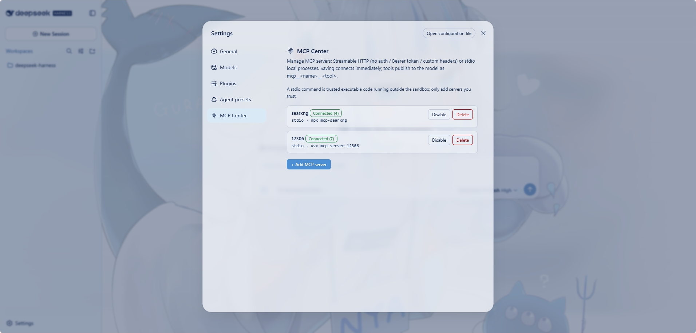

# MCP Center

[English](README.md) | 中文

**把任意 MCP 服务器接入你的 DeepSeek Harness，全程可视化，点几下鼠标即可。** MCP Center 是一个设置驱动的 MCP 服务器管理器：在专属的 **设置 → MCP Center** 页面注册服务器（Streamable HTTP 或本地 stdio 进程），保存即连接，它们的所有工具立刻成为模型可调用的原生工具。



## 为什么选它

- **零代码接入**：无需手写配置、无需命令行，一切都在设置页的图形界面里完成。
- **两类 MCP 服务器都支持**：
  - **Streamable HTTP**：远程 MCP 端点，鉴权可选（无鉴权 / Bearer Token / 自定义 Headers）。
  - **stdio**：本地进程（`npx` / `uvx` / `python` …）。
- **工具即插即用**：已连接服务器的工具以 `mcp__<名称>__<工具>` 出现在所有会话中，模型可直接调用。
- **开箱即用**：客户端传输由插件自身实现，不依赖外部 MCP SDK，安装进 profile 不带任何额外依赖链。
- **随时开关**：每台服务器可独立启用/禁用，禁用即注销其工具并断开连接，配置保留。

## 环境要求

- 带 `web` profile 的 DeepSeek Harness
- Node.js `^22.19` 或 `>=24`

## 快速开始

### 1. 安装插件

该包已发布到 npm，包名为 **`dsh-mcp-center`**：

```sh
# 从 npm 仓库直接安装
dsh plugin --profile web add dsh-mcp-center
```

想从源码安装？参见[开发](#开发)。

### 2. 重启并打开设置页

重启 `dsh web`，打开 **设置 → MCP Center**，点击 **＋ 添加 MCP 服务器**：

- **Streamable HTTP**：填写名称（即 `mcp__<名称>__*` 前缀）、URL，选择鉴权方式（无鉴权 / Bearer Token / 自定义 Headers）。
- **stdio**：填写名称、命令（如 `npx`）、参数（空格分隔，含空格的参数用引号包住），可选填环境变量（JSON）与工作目录。

### 3. 保存即连接

保存后服务器立即连接。状态徽标显示 `已连接 (N 个工具)` / `连接中` / `错误` / `已禁用`。每台服务器都支持启用/禁用、删除，Bearer 服务器还可随时更换 Token。

### 模型立刻就能用

已连接服务器的工具对模型而言是头等工具。例如名为 `web` 的服务器：

```
mcp__web__ping    mcp__web__shout
```

工具结果以原生文本渲染；`isError` 结果经注册表的错误路径呈现。

> 插件只依赖 `@deepseek-ai/cordis`（peer）和 React（client 半）。无 MCP SDK、无 settings 服务耦合、无需解析 MCP peer 包的 fallback 树。

## 配置存储

服务器配置保存在 `~/.dsh/mcp-center.json`：

```json
{
  "servers": [
    { "id": "…", "name": "web", "type": "http", "url": "http://localhost:3000/mcp", "authMode": "none" },
    { "id": "…", "name": "fs", "type": "stdio", "command": "npx", "args": ["-y", "@modelcontextprotocol/server-filesystem", "/tmp"] }
  ]
}
```

> ⚠️ Bearer Token 以明文保存在该文件中——请把它当作机密文件对待。

## 工作原理

| 组成 | 机制 |
|---|---|
| 设置页 | `settings.section` 槽条目（MCP Center 页） |
| API | `/mcp-center/api/*` 下的同源 JSON（ping、服务器增删改查、connect、enabled） |
| HTTP 传输 | Streamable HTTP：POST 上的 JSON-RPC，`Mcp-Session-Id`，JSON 或 SSE 响应（逐个 SSE 帧解析，因此一个流可承载多条消息） |
| stdio 传输 | `child_process.spawn` 本地命令，stdin/stdout 上的 JSON-RPC（换行分隔）；重连先回收旧进程 |
| 工具 schema | 服务器 JSON Schema 清洗为注册表支持的原始子集（不支持的词汇降级为无约束） |
| 状态 | `~/.dsh/mcp-center.json`，原子写入且仅所有者可读写 |

## 当前限制

- 仅桥接 tools，不提供 `resources` / `prompts` 能力。
- Bearer Token 与自定义认证头以明文存放在 `~/.dsh` 下的状态文件中，权限仅所有者可读写——请视为机密。
- 配置存在但无法解析时，插件加载会失败，而不是以「零服务器」启动：否则下一次保存会覆盖该文件并丢失全部已存服务器。
- 请求体上限 1 MiB（超出返回 413），单个 stdio 服务器未解码的 stdout 上限 4 MiB；超出后者会使其待处理调用失败并停止该进程。
- stdio 服务器是与插件生命周期绑定的长驻子进程；`args` 按空白分词（含空格的参数用引号包住），不做 shell 展开——`~`、`$VAR`、管道等请自行写成绝对路径或环境变量。
- 本版本没有崩溃后自动重连；重新启用或重启服务器即可重连。

## 开发

```sh
pnpm install
pnpm build      # tsdown：lib/index.js（Node）+ lib/client.js（浏览器）
pnpm typecheck
```
